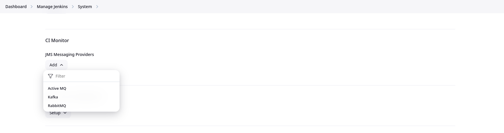
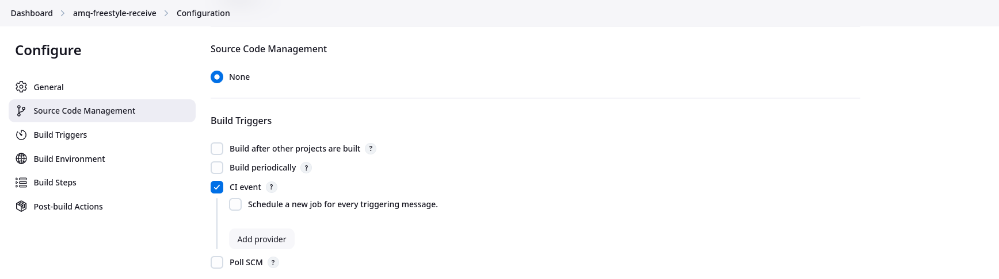
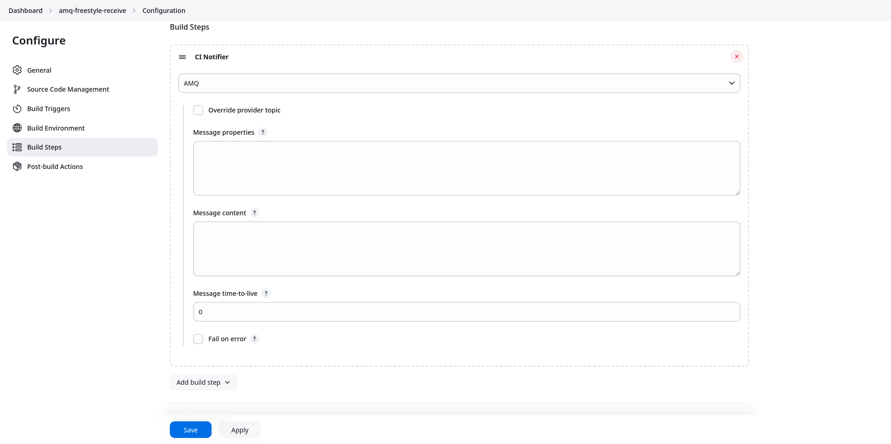
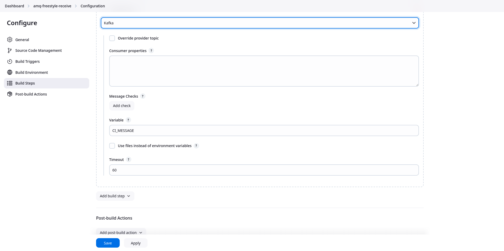
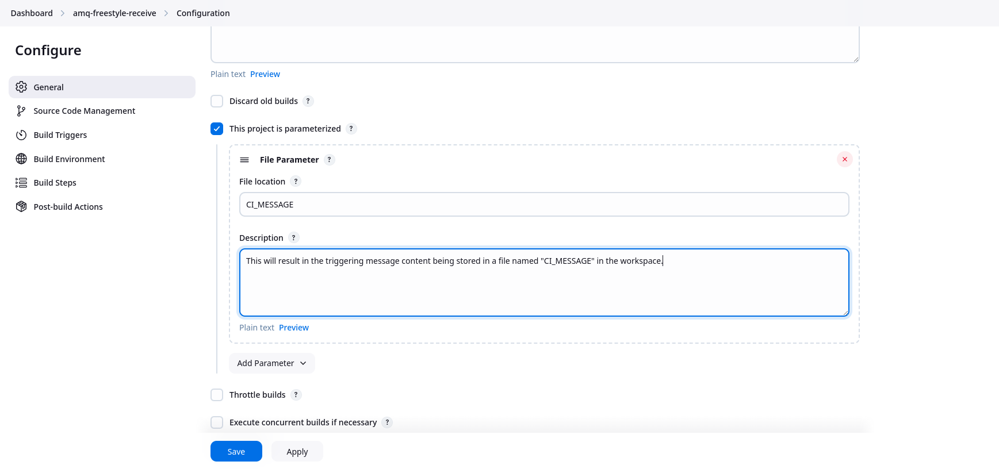
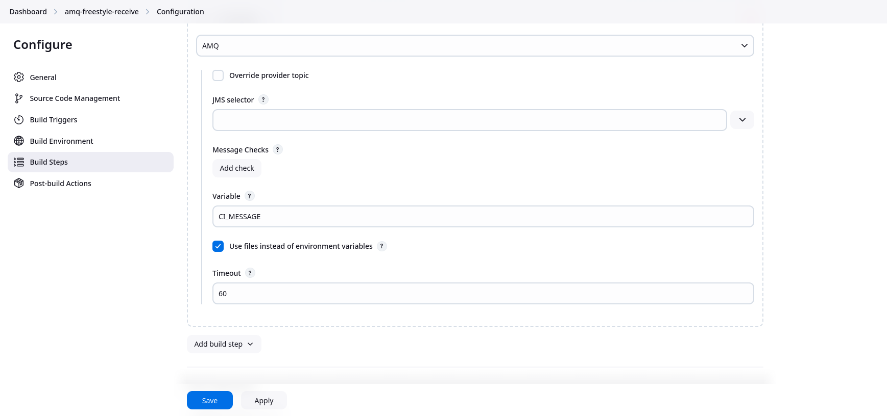

[](https://ci.jenkins.io/job/Plugins/job/jms-messaging-plugin/job/master/)
[](https://github.com/jenkinsci/jms-messaging-plugin/graphs/contributors)
[](https://plugins.jenkins.io/jms-messaging)
[](https://github.com/jenkinsci/jms-messaging-plugin/releases/latest)
[](https://plugins.jenkins.io/jms-messaging)

# JMS Messaging Plugin

- Trigger Jenkins builds upon receipt of a matching message.
- Await a message in the middle of a Job.
- Send a message from Jenkins Job.

JMS Messaging Providers

-   This plugin supports the following JMS Messaging Provider types
    -   ActiveMQ
    -   Kafka
    -   RabbitMQ

The version 2 releases the plugin are not backward-compatible with version 1 releases. Some
of the incompatible changes include:

- Removal of FedMsg as a supported provider.
- Removal of CI message types.
- Authentication changed to use Jenkins credentials.

> [!NOTE]
> This file contains only documentation for version 2 and later releases.  For version 1
> and earlier release documentation, please see the [v1 README file](README-version1.md).

## Set Up

### Global Configuration

Before the plugin may be used, you must add at least one JMS Messaging Provider.
This will provide the ability to send and receive messages. Below is a
list of currently supported JMS Messaging Providers:

-   ActiveMQ
-   Kafka
-   RabbitMQ



Add the providers of your choice and provide the necessary configuration parameters.
To ensure your configuration is correct, click the "Test Connection" button to 
validate that your connection works.

#### Configuration as code

Example:

```yaml
unclassified:
  jmsProviders:
    configs:
      - activeMq:
          name: "Active MQ"
          broker: "foo.com:4242"
          topic: "active.mq.com"
          topicProvider: "default"
          useQueues: false
          authenticationMethod:
            simple:
              credentialId: "amq-username-password"
      - kafka:
          name: "Kafka"
          topic: "default.topic"
          producerProperties: "bootstrap.servers=localhost:9092"
          consumerProperties: "bootstrap.servers=localhost:9092"
      - rabbitMq:
          name: "Rabbit MQ"
          exchange: "ex"
          hostname: "rabbitmq.example.com"
          portNumber: "4545"
          queue: "foo.bar"
          topic: "baz"
          virtualHost: "rabbitvh.example.com"
          authenticationMethod:
            sslCertificate:
              keyStoreCredentialId: "rabbitmq-keystore-credential-id"
              trustStoreCredentialId: "rabbitmq-truststore-credential-id"
```

## Triggering

To enable the CI trigger, go to the job configuration page and add click
the check box "CI Event" under the Build Triggers section.



Note the "Schedule a new job for every triggering message checkbox". By
default, Jenkins will "squash" jobs, so that if a job is queued and
another triggering message is received, a new job is not submitted and
the job is "squashed" into the job already queued. Checking this box
will cause a job to be scheduled for every triggering message.

To access the content of the triggering message, see the
[Retrieving Message Content](#retrieving-message-content) section.

## Build Steps

### CI Notifier

The plugin provides a build step for publishing messages.
To add the CI Notifier build step, go to the job
configuration page, in the "Build Steps" section click the "Add 
Build Step" button, and then select the "CI Notifier" option.

You will then be presented with option for configuring the build
step. These options differ by messaging provider. Select the messaging
provider you want from the drop-down menu and then fill in the
configuration options as appropriate.

Following is an example of the CI Notifier build step for an
AMQ messaging provider:



### CI Subscriber

The plugin provides a build step for a job to wait for messages.
To add the CI Subscriber build step, go to the job
configuration page, in the "Build Steps" section click the "Add 
Build Step" button, and then select the "CI Notifier" option.

You will then be presented with option for configuring the build
step. These options differ by messaging provider. Select the messaging
provider you want from the drop-down menu and then fill in the
configuration options as appropriate.

Following is an example of the CI Subscriber build step for a
Kafka messaging provider:



To access the content of the triggering message, see the
[Retrieving Message Content](#retrieving-message-content) section.

## Post-Build Steps

### CI Notifier

See the [CI Notifier build step documentation](#ci-notifier).

## Pipeline Support

### Triggers

The CI Trigger is available via the triggers section in a declarative pipeline.

The easiest way to create a CI Trigger in your pipeline is to use the
[Declarative Directive Generator](https://www.jenkins.io/doc/book/pipeline/getting-started/#directive-generator).
This will allow you to configure your CI trigger and then generate the 
equivalent code that you can then cut and paste directly into your declarative pipeline.

To generate CI Trigger code using the Declarative Directive Generator, navigate
to the generaton in the Jenkins UI, select "triggers: Trigger" from the "Sample
Directive" drop-down, the click the "Add" drop-down and select "ciBuildTrigger: CI Event".
Then configure your trigger and click the "Generate Declarative Directive" button.

Here's an example of what a CI trigger may look like:

```groovy
triggers {
  ciBuildTrigger(providers: [activeMQSubscriber(name: 'AMQ', selector: 'foo = bar')])
}
```
### Steps

The plugin provides steps for both sending and receiving messages
when using the Jenkins Pipeline feature. The easiest way to use these steps
in your pipeline is to use the
[Snippet Generator](https://www.jenkins.io/doc/book/pipeline/getting-started/#snippet-generator).
This will allow you to configure your pipeline step and then generate the 
equivalent code that you can then cut and paste directly into your pipeline.

#### sendCIMessage

This is the Freestyle CI Notifier Build Step and Post-Build Action sibling.

To generate code using the Snippet Generator, navigate to it in the Jenkins
UI and select the sample step "sendCIMessage: CI Notifier". Then fill in the desired
options to configure the step and click the "Generate Pipeline Script" button
at the bottom.

A sample step may look something like this:

```groovy
sendCIMessage rabbitMQPublisher(failOnError: true, messageContent: '{"msg": "This is my message"}', name: 'RabbitMQ')
```

#### waitForCIMessage

This is the Freestyle CI Subscriber Build Step sibling.

To generate code using the Snippet Generator, navigate to it in the Jenkins
UI and select the sample step "waitForCIMessage: CI Notifier". Then fill in the desired
options to configure the step and click the "Generate Pipeline Script" button
at the bottom.

A sample step may look something like this:

```groovy
waitForCIMessage kafkaSubscriber(name: 'Kafka', timeout: 30, useFiles: true)
```

> [!NOTE]
> The `waitForCIMessage` step also returns the message content as a string.
> This is in addition to the other ways the message content is available
> that are described in [Retrieving Message Content](#retrieving-message-content).

## Job DSL Support

The plugin trigger and steps can be used with job DSL as well. Here's an example
job DSL that creates a job with a CI Trigger, a plugin step, and a post-build action.

```groovy
job('example-1') {
    triggers {
        ciBuildTrigger {
            providers {
                activeMQSubscriberProviderData {
                    name("AMQ")
                    overrides {
                        topic("different.topic")
                    }
                    checks {
                        msgCheck {
                            field('$.artifact.type')
                            expectedValue("cvp")
                        }
                    }
                }
            }
            noSquash(true)
        }
    }
    steps {
        ciMessageSubscriberBuilder {
            providerData {
                activeMQSubscriber {
                    checks {
                        msgCheck {
                            field('$.msg')
                            expectedValue("sample")
                        }
                    }
                    name("AMQ")
                    selector("foo = 'bar'")
                    timeout(30)
                }
            }
        }
    }
    publishers {
        ciMessageNotifier {
            providerData {
                activeMQPublisher {
                    failOnError(true)
                    messageContent("{'msg': 'This is a sample message'}")
                    messageProperties("foo=bar")
                    name("AMQ")
                }
            }
        }
    }
}
```

> [!NOTE]
> The Job DSL plugin is a good resource for creaing DSL for the JMS messaging
> plugin's trigger and job steps. Make sure the plugin is installed, then
> go to ${YOUR\_JENKINS\_URL}/plugin/job-dsl/api-viewer/index.html#plugin/jms-messaging.

## Retrieving Message Content

### Environment Variables

By default, the trigger and the CI Subscribe job steps save the triggering message
content in an environment variable that is made available in the job.
The name of this variable is configurable and defaults to "CI\_MESSAGE".

> [!NOTE]
> For the AMQ provider, the trigger will also set an environment
> variable named "${VARIABLE}\_HEADERS" with the JSON content
> representing the message headers.
>
> For the Kafka provider, the trigger will also set an environment
> variable named "${VARIABLE}\_RECORD" with the JSON content
> representing the entire Kafka record.

There may be instances where the message size may be too large to be stored
in an environment variable. If this occurs, the job is failed.

In this case the message content can be passed in files, as detailed
in the [Files](#files) section.

### Files

When messages are too large to be stored in an environment variable, the
plugin provides functionality for passing the message content by file.
The method for configuring this differs for the trigger and the job steps.

The file name used for the message content is the value specified for the Variable
in the configuration of the trigger or the step.

> [!NOTE]
> For the AMQ provider, the trigger will also set create a 
> file named "${VARIABLE}\_HEADERS" with the JSON content
> representing the message headers.
>
> For the Kafka provider, the trigger will also create a
> file named "${VARIABLE}\_RECORD" with the JSON content
> representing the entire Kafka record.

#### CI Trigger

To enable passing message content by file in the CI Trigger, simply create
a file parameter on the job with the same name as the Variable value specified
in the configuration.

> [!NOTE]
> For the AMQ provider, if you want the headers also passed in a file,
> create a file parameter named "${VARIABLE}\_HEADERS" on the job.
>
> For the Kafka provider, if you want the headers also passed in a file,
> create a file parameter named "${VARIABLE}\_RECORD" on the job.

Here's an example:



#### CI Subscriber

To enable passing message content by file in the CI Subscriber, check
the "Use files instead of environment variables" checkbox in the
configuration.

> [!NOTE]
> For the AMQ provider, this will also result in the creation
> of a file named "${VARIABLE}\_HEADERS" in the workspace.
>
> For the Kafka provider, this will also result in the creation
> of a file named "${VARIABLE}\_RECORD" in the workspace.

Here's an example:


